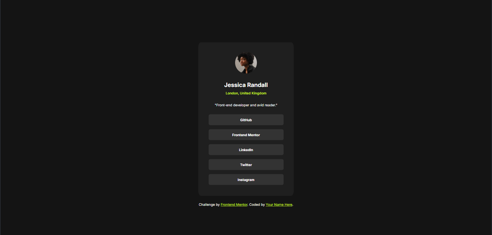
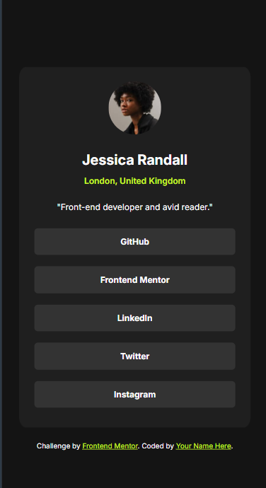
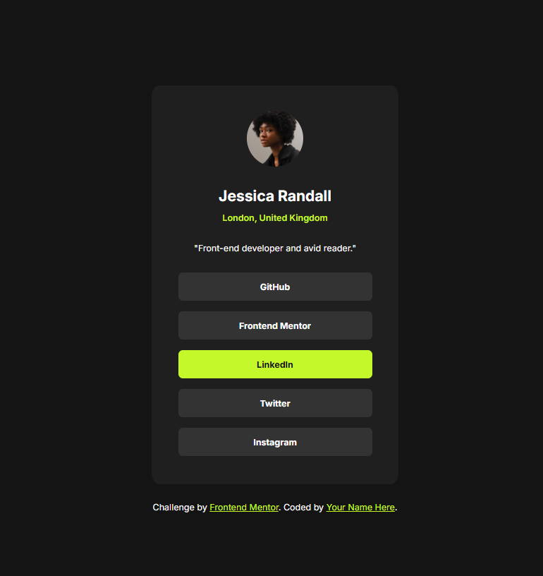

# Frontend Mentor - Social links profile solution

This is a solution to the [Social links profile challenge on Frontend Mentor](https://www.frontendmentor.io/challenges/social-links-profile-UG32l9m6dQ). Frontend Mentor challenges help you improve your coding skills by building realistic projects. 

## Table of contents

  - [The challenge](#the-challenge)
  - [Screenshot](#screenshot)
  - [Links](#links)
  - [Built with](#built-with)
  - [What I learned](#what-i-learned)
  - [Continued development](#continued-development)
  - [Author](#author)

### The challenge

Users should be able to:

- See hover and focus states for all interactive elements on the page

### Screenshot

### Links

- Live Site URL:(https://devraph12.github.io/social-links-profile-main/)

### Built with

- Semantic HTML5 markup
- CSS custom properties
- Flexbox
- Mobile-first workflow

### What I learned

Great exercise to learn element position, relationship between divs and elements, I learned how to manipulate the elements using Flexbox, also how to make them look amazing with padding and margin, as well as giving these elements different sizes acoording to the screen size.

## Author

- Linkedin - [Raphael Almeida](https://www.linkedin.com/in/raphael-almeida-dev12)
- Frontend Mentor - [@DevRaph12](https://www.frontendmentor.io/profile/DevRaph12)

